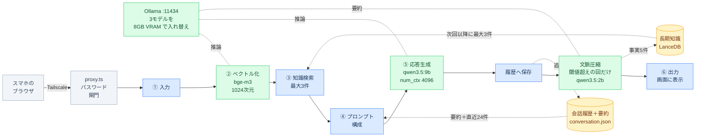
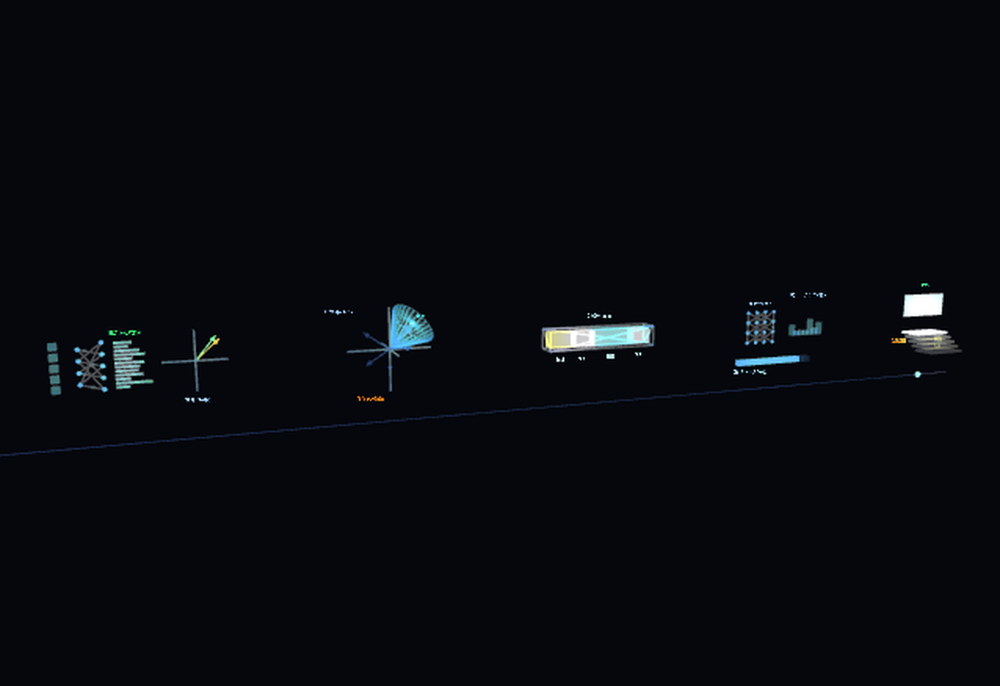
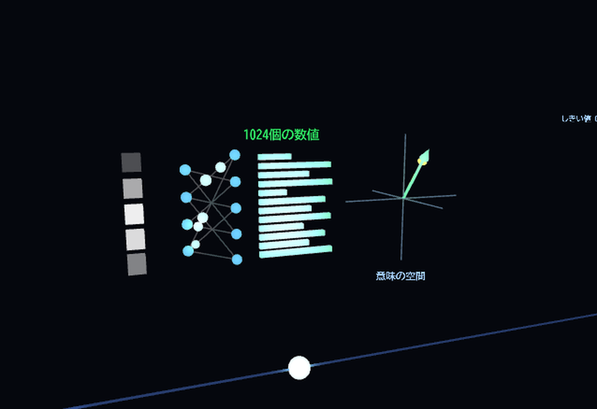
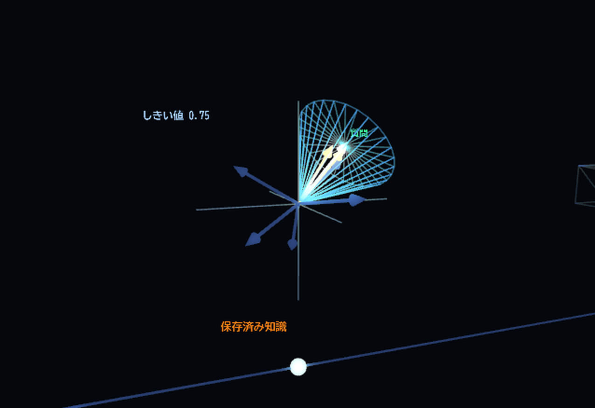
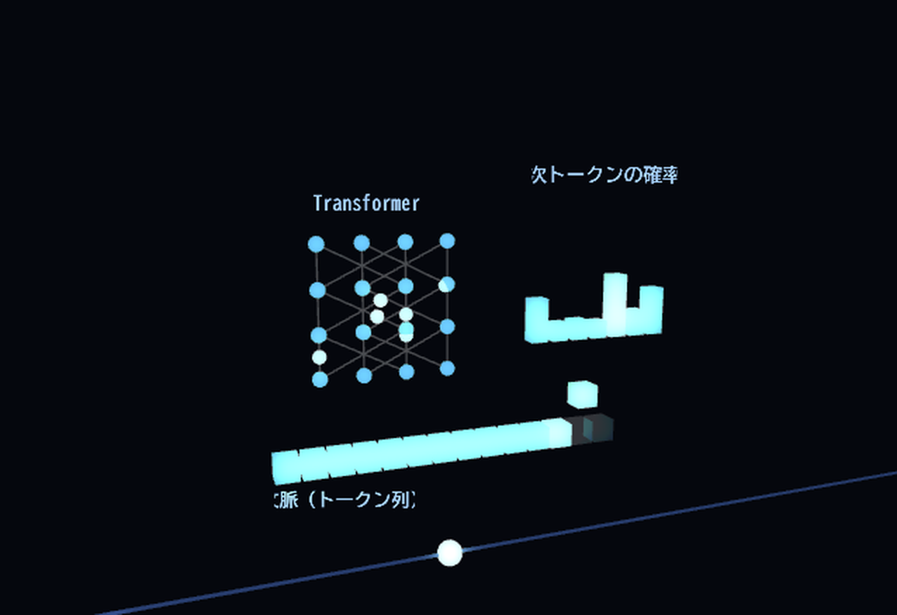

## この記事について

TypeScript を学習中の人間が、Claude（チャット）で構想を練り、Claude Code とペアプログラミングをしながら、自宅の非力なPCでローカルLLMのアプリを作った記録です。

できあがったものは、自宅PCに常駐させた Ollama とアプリに対して、外出先のスマホのブラウザから話しかける、という形で使っています。

作りながら一番向き合ったのは「遅さ」でした。このマシンでは、短い返答なら数秒で返りますが、それなりの長さを求めると十数秒は待ちます。工夫で多少は縮められても、消すことはできません。

そこでこの記事は、速くする方法だけでなく、**遅いことを前提に、待ち時間そのものをどう設計したか**を中心に書きます。同じスペック帯で試そうとしている方が、同じ穴に落ちずに済むように、詰まった箇所も残します。

:::message
筆者も学習中です。「こうすべき」ではなく「やってみたらこうだった」として読んでいただければと思います。
:::

---

## 1. きっかけ — 「Python じゃなくてもいいんだよ。機械学習じゃないし」

隣の部署にインターンの方が来ていて、そのメンターが嬉しそうに教えてくれました。そのインターンの方が、生成AIとペアプログラミングをしながら、ローカルLLMのワークフローをさらっと Python で組み上げてしまった、と。自慢げに話すその様子が、妙に印象に残りました。

それで火がつきました。ワークフローを自分で作ってみたいという気持ちは、以前からありました。ただ、自分には Python の知識がありません。そこが、動けない理由になっていました。

その日の帰宅する電車の中で Claude とチャットで壁打ちをしていました。ローカルLLMで何か自作してみたいけれど、自分は Python も機械学習も学べていないし。

そこで返ってきたのが、だいたいこういう趣旨の一言でした。

> 別に Python じゃなくてもいいんだよ。これは機械学習（モデルを学習させる作業）じゃなくて、動いているモデルを API 越しに呼ぶだけだから。

これが転換点でした。「ローカルLLM」というと Python と PyTorch のイメージが強く、勝手に自分には無理な領域だと思い込んでいたのですが、実際にやることは **HTTP で Ollama を叩き、返ってきた文字列を扱う**だけです。それなら、いま学んでいる TypeScript と Next.js でそのまま組めます。

この思い込みが外れてからは、設計から実装まで一息に進みました。

1. Claude と対話しながら **仕様書** を書く（何を作るか、なぜワークフロー型か、待ち時間をどう扱うか）
2. **調査書** で技術選定を固める（ベクトルDBは何にするか、モデルは何を選ぶか、Tailscale をどう使うか）
3. **実行計画書** でフェーズに分ける（環境準備 → 疎通 → 会話管理 → RAG → 圧縮 → 管理画面 → 認証 → 可視化）
4. あとは **Claude Code とペアプログラミング**。1フェーズずつ実装し、動作確認をして次へ進む

非力なPCの遅さから出発したはずが、最終的には、その待ち時間を短く感じさせる体験まで作ることができました。

この記事を書いているのも、その延長にあります。AIに問えば答えが返ってくるのは、誰かが自分の詰まった箇所を書き残してくれたからです。自分もそこに一助を加えたい、という気持ちがあります。

---

## 2. まず、どんなマシンか

同じモデルを動かしても、GPUの有無とVRAM容量で体感はまったく変わります。

使ったマシンは次のとおりです。

| 部品 | スペック |
|---|---|
| CPU | AMD Ryzen 7 5700G（8コア / 16スレッド） |
| GPU | Radeon RX Vega（VRAM 8GB） |
| メモリ | 16GB |
| OS | Windows 11 |
| LLM実行 | Ollama 0.33（GPUは Vulkan 経由で利用） |

:::message
**VRAM とは**：GPU が持つ専用メモリのことです。LLM は「モデルの重み」と「会話の文脈」を VRAM に載せて計算します。ここに載りきらない分は CPU 側のメモリへ追い出され、その部分だけ極端に遅くなります。VRAM 8GB は、ローカルLLM界隈では小さめの部類です。
:::

この構成で、応答生成に **90億パラメータのモデル（`qwen3.5:9b`）** を使い、後述する `num_ctx` を調整した状態で、おおむね **22 tok/s** が出ます。

:::message
**tok/s（トークン毎秒）とは**：1秒あたりに生成されるトークンの数で、生成速度の単位です。
**トークンとは**：モデルが読み書きする最小単位です。単語よりやや細かく、日本語ではおおよそ1〜2文字で1トークンになります。
:::

体感としてどのくらいかというと、フェーズ1の実測では、342トークンの返答が **21.8 tok/s で 16.1 秒**（初回のモデルのコールドロード込み）でした。一方、`東京が日本の首都です。` 程度の短い返答であれば、ウォーム時で1〜2秒です。

つまり、短い受け答えは軽快でも、まとまった量の返答を求めた瞬間に十数秒の待ちが挟まります。さらに、後述する文脈圧縮が走る回では要約用モデルが VRAM に読み込まれ、応答用モデルが一時退避するため、その回だけ待ちが伸びます。

この「待ちは必ず残る」という前提から、アプリの設計を3方向で考えました。

1. 待ち時間を**短くする**（チューニング）
2. 待ち時間が**育たないようにする**（文脈の圧縮）
3. 待ち時間を**別のものに変える**（可視化）

---

## 3. 使い方 — 自宅PCに置いて、外からスマホで話す

このアプリは、次の前提で作っています。

- **自宅PCは基本つけっぱなし。** そこで Ollama とこのアプリ（Next.js のサーバー）が常駐します
- **クライアントはスマホのブラウザ。** 専用アプリは用意せず、外出先から `http://<自宅PC>:3000` を開くだけです
- **使うのは自分ひとり。**

この「1人・1台・スマホから」という形が、実装のあちこちに効いてきます。

### 3-1. なぜスマホから使う前提が重要か

セクション2で触れた待ち時間は、デスクの前でPCの画面を見ているときよりも、外出先でスマホを片手に立って待っているときのほうが、はるかに長く感じられます。

つまり「スマホから使う」と決めた時点で、待ち時間の設計（セクション5〜7、とくに可視化）は「あると嬉しいもの」から「ないと使い続けられないもの」に変わります。可視化は、スマホでも指で回せるようにしてあります。

### 3-2. 外の端末から自宅PCに繋ぐ — Tailscale を選んだ

自宅PCに外から繋ぐ素朴な方法は、ルーターのポート開放（ポートフォワーディング）と DDNS の組み合わせです。これは見送りました。

| 方式 | 判断 | 理由 |
|---|---|---|
| ポート開放 + DDNS | 不採用 | 自宅のポートをインターネット全体に晒すことになります。総当たりのログイン試行が来ますし、まともに運用するなら TLS 証明書の用意と要塞化が必要で、個人利用には重すぎます |
| **Tailscale** | 採用 | WireGuard ベースのメッシュVPNです。自分のデバイスだけが入れるプライベートなネットワーク（tailnet）を構成でき、**ルーター設定も公開ポートも不要**です |

Tailscale を導入すると、自宅PCとスマホがそれぞれ `100.x.x.x` 台の固定アドレスを持ち、同一LAN上にいるかのように通信できます。スマホがモバイル回線であっても同じです。経路は WireGuard により端末間で暗号化されます。

なお、公開インターネットへ露出させる Funnel は、個人用の管理画面には不要と判断して使っていません。

:::message
**VPN / メッシュVPN とは**：離れた端末どうしを暗号化されたトンネルで結び、同じネットワークにいる状態を作る仕組みです。Tailscale は、その設定をアカウントにログインするだけまで簡略化したものと考えると分かりやすいと思います。
:::

### 3-3. Tailscale 前提でアプリ側に効いたこと

**(a) サーバーを `0.0.0.0` で待ち受ける**

`next start` は既定で localhost のみにバインドするため、そのままでは同じPC以外から到達できません。全インターフェースで待ち受けます。

```bash
next start -H 0.0.0.0 -p 3000
```

これで tailnet 側から `http://<TailscaleのIP>:3000` で開けるようになります。Tailscale Serve（TLS終端付きのプロキシ）は使わず、素の HTTP のままにしました。

**(b) 共有パスワード1つで認証する**

tailnet 内とはいえ認証は入れます。ただし1人用なので、共有パスワード1つで十分です。Next.js 16 では middleware の規約ファイルが **`proxy.ts`** に改名されている（export 名も `middleware` から `proxy` へ）ので、そこで全ルートをゲートします。

```ts:src/proxy.ts
const PUBLIC_PATHS = ["/login", "/api/auth/login"];

export async function proxy(req: NextRequest) {
  if (!isAuthEnabled()) return NextResponse.next(); // APP_PASSWORD 未設定なら素通し

  const { pathname } = req.nextUrl;
  if (PUBLIC_PATHS.some((p) => pathname === p)) return NextResponse.next();

  if (await verifyToken(req.cookies.get(AUTH_COOKIE)?.value)) {
    return NextResponse.next();
  }
  // API は 401 を返し、画面はログインへリダイレクト
}
```

Cookie に入れるのは、パスワードそのものではなく、そこから導出した不透明な値です。Web Crypto を使っているのは、Edge で動く proxy と Node の route handler の両方から同じ関数を呼ぶためです。

```ts:src/lib/auth.ts
export const AUTH_COOKIE = "llmwf_auth";

/** パスワードから導出した Cookie 値 */
export function expectedToken(): Promise<string> {
  return sha256Hex(`llm-workflow:v1:${PASSWORD}`);
}
```

**(c) Cookie に `Secure` を付けない**

上記のとおり素の HTTP で運用しているため、`Secure` 属性を付けると Cookie が `http://100.x...` で送受信されず、ログインが通りません。**WireGuard のトンネル自体が既に暗号化されている**ことを根拠に、この用途では `Secure` なしを許容しています。

:::message alert
これは「自分の tailnet の中だけ・自分ひとり」という前提で成り立つ割り切りです。複数人で使う場合や公開する場合は、TLS を張ったうえで `Secure` を付けてください。
:::

**(d) 画面をスマホ幅に対応させる（管理画面も含めて）**

スマホが主クライアントなので、チャット画面だけでなく、**管理画面（死活監視・再起動・強制圧縮）もレスポンシブ**にしました。外出先で応答がおかしくなったときに、スマホから Ollama を再起動できます。

**(e) 会話はサーバー側に1本だけ持つ**

1人・1台という前提なので、会話はサーバー側のグローバルな1本として保持し、`data/conversation.json` に永続化しています。複数スレッドは持ちません。管理画面も「現在の会話」を指す前提で組めるため、全体がかなり単純になりました。

---

## 4. 何を作ったか（概要）

チャット形式ではなく**ワークフロー型**にしました。自宅PCの上に Next.js アプリと Ollama が並んで常駐し、外からはスマホのブラウザだけが繋がります。1通のメッセージは、決まった6工程を順に通ります。



矢印つきの線はデータが流れる向き、矢印のない点線は「そのサービスを使う」関係です。色にも意味を持たせています。**緑がニューラルネットを実際に使うところ**、橙が保存先、青がそれ以外です。

**6工程のうち、モデルを呼ぶのは②と⑤の2つだけです。** 残りは検索であり、文字列の組み立てであり、保存です。セクション7で可視化を作り直したのも、ここを取り違えていたからでした。

- チャットUIがモデルに丸投げする形なのに対し、ワークフロー型は各工程が独立した関数で、順番に呼び出されます
- フロントもバックも TypeScript と Node.js のみで、Python は使いません
- フレームワークは Next.js 16、ベクトルDBは LanceDB（アプリ内蔵）、可視化は Babylon.js です

モデルは**役割ごとに3つへ分けました**。VRAM が小さいため、1つの賢いモデルにすべてを任せるより、用途ごとに軽いモデルを使い分けるほうが現実的でした。

| 役割 | モデル | 選定理由 |
|---|---|---|
| 応答生成 | `qwen3.5:9b` | ユーザーへの返答。ある程度の賢さが必要 |
| 要約・事実抽出 | `qwen3.5:2b` | 会話の圧縮用。速度優先の軽量モデル |
| 埋め込み | `bge-m3` | 文章を1024次元のベクトルに変換（検索用） |

:::message
8GB VRAM では、この3つを同時に載せておくことはできません。Ollama が必要に応じて入れ替えます。そのぶん、切り替わる回だけ待ちが伸びます。
:::

---

## 5. アプローチ1 — 待ち時間を短くする

### 5-1. `num_ctx` を絞らないと、勝手に遅くなる

:::message
**コンテキスト長 / `num_ctx` とは**：モデルが一度に見られるトークンの「窓」の大きさです。会話履歴やプロンプトをこの窓に収めてモデルへ渡します。窓が大きいほど VRAM を消費します。
:::

Ollama の `num_ctx` は既定で 16384 です。8GB VRAM で `qwen3.5:9b` をこの設定のまま動かすと、モデルと文脈が VRAM に収まりきらず、一部が CPU に落ちます。

`ollama ps` で確認できます。

```
NAME          SIZE      PROCESSOR          CONTEXT
qwen3.5:9b    6.6 GB    12%/88% CPU/GPU    16384    ← 12% が CPU にいる
```

この状態では、**22 tok/s が 13 tok/s まで落ちます**。4割の低下です。

リクエストで `num_ctx` を 4096 と明示すると、フットプリントが 5.5GB になり、**100% GPU** に載ります。

```ts
await fetch("http://127.0.0.1:11434/api/chat", {
  method: "POST",
  body: JSON.stringify({
    model: "qwen3.5:9b",
    messages,
    stream: false,
    options: { num_ctx: 4096 }, // これがないと CPU に溢れて遅くなる
  }),
});
```

窓を小さくすると、一度に覚えていられる会話量は減ります。その分はアプローチ2（圧縮）で補います。

### 5-2. 思考モデルは、思考を切らないと空の返答が返る

`qwen3.5` は **reasoning（思考）モデル**です。答える前に内部で検討し、`<think>...</think>` を出力するタイプです。

これを有効のまま使うと、**思考だけでトークン予算を使い切り、本文（`content`）が空のまま返ってきます**。しかも約52秒かけてです。

返答が空になる原因が分からず、しばらく時間を使いました。対処は1行です。

```ts
body: JSON.stringify({
  model: "qwen3.5:9b",
  messages,
  stream: false,
  think: false, // 思考モデルを通常のチャットとして使うなら必須
  options: { num_ctx: 4096 },
}),
```

これを入れたところ、ウォーム時の短い応答は1〜2秒まで短縮されました。

:::message alert
`ollama run qwen3.5:9b "こんにちは"` を CLI で試すと普通に返ってくるのに、API から呼ぶと空になる、という症状で現れます。`think` を明示的に `false` にしてください。
:::

### 5-3. モデルを大きくしすぎない

より賢いモデルをと 14B や 30B を試したくなりますが、8GB VRAM では確実に CPU へ溢れ、10 tok/s を切ります。返答に1分以上かかる状態は、実用に耐えません。

このマシンでは **9B が上限**でした。日本語の品質は `qwen3.5:9b` で十分実用的です。

---

## 6. アプローチ2 — 待ち時間が育たないようにする

### 素朴なチャットアプリは、会話が伸びるほど遅くなる

チャットアプリは通常、過去のやり取りをすべてプロンプトに詰めてモデルへ渡します。会話が長くなると、次の2つが起こります。

- プロンプトが長くなり、毎ターンの処理が重くなる
- やがて `num_ctx` の窓から溢れる

「最初は速かったのに、話しているうちに遅くなった」の正体はこれです。

### 会話マネージャーで、古い部分を要約に畳む

対策として、**会話マネージャー**という層を1枚挟みました。

- 履歴とローリング要約（それまでの会話の要約）を保持し、`data/conversation.json` に保存します
- 応答を作った直後に判定します。生の履歴が **約1400トークン超**、または **メッセージ12件超**（＝6ターン超）で自動圧縮します
- 圧縮では、直近4ターンをそのまま残し、それより古い部分を要約モデル（`qwen3.5:2b`）で1つの要約にまとめます
- 以後モデルへ渡すのは「要約（system） + 直近4ターン」だけになります

```
[圧縮前] 質問1 回答1 質問2 回答2 ... 質問10 回答10   ← 全部渡す（重い）
[圧縮後] 要約(1〜6ターンぶん) + 質問7 回答7 ... 質問10 回答10   ← 軽い
```

:::message
画面に表示される会話は、すべてそのまま残っています。畳むのは**モデルに送る中身だけ**です。圧縮が起きたことは、ユーザーに小さく通知します。
:::

### 圧縮のついでに、重要な事実を長期記憶へ移す

圧縮のタイミングで、要約モデルに「今後も覚えておくべき事実（名前・好み・決定事項など）」を最大5件抽出させ、**RAG の知識ベースへ保存**しています。

こうしておくと、要約から漏れた細かい事実も、質問時の検索で拾えます。**会話は畳んでも、大事なことは残り続けます。**

### 応答が重いと感じたときの手動ボタン

自動圧縮の閾値を待たず、ユーザーが即座に圧縮できるボタンも用意しました。こちらは直近1ターンだけを残してすべて畳みます。生成が不安定になってきたときの緊急脱出用です。

### 書いていて気づいた設計ミス — 圧縮を待ってから表示している

この記事のために処理順を図にしていて、まずいことに気づきました。`/api/chat` の中身は次の順です。

```
応答生成 → 履歴へ保存 → 圧縮判定 → done イベントで本文を返す
```

本文がクライアントへ渡るのは最後の `done` だけなので、**圧縮が走る回は、圧縮が終わるまで画面に何も出ません**。しかも圧縮は要約モデルのロードを伴い、8GB VRAM では応答用モデルが一時退避します。つまりユーザーは、自分の返答にはもう不要な後片付けを待たされています。

待ち時間を削るための仕組みが、待ち時間を作っていたわけです。

正しくは、`done` で本文を返してから圧縮を走らせるべきでした。今のコードでは `await` の位置を変えるだけで直せます。

```ts
// 現在：圧縮を待ってから返している
compaction = await step("compact", "コンテキストを確認", () => maybeCompact());
send({ type: "done", reply: result.reply, /* ... */ });
```

ただし「圧縮しました」の通知を同じレスポンスに載せている都合があるので、通知の出し方ごと考え直す必要があります。

---

## 7. アプローチ3 — 待ち時間を「別のもの」に変える

### 発想 — 「ローカル」の反対側にあるのはブラックボックス

「ローカル」の対義語はクラウドです。そしてクラウドのAIは、基本的にブラックボックスです。入力と出力は見えても、その間で何が起きているかは分かりません。

自分の機械の上で動かしているのに、中身が見えないままというのは、もったいない話だと思いました。

作っている途中で、ふとある言葉が浮かびました。**「機械の中を覗く窓」**です。金属に動力を与えて加工するような機械には、たいてい覗き窓が付いています。扉を開けて止めなくても、動いている中身をそのまま見られる。あれを実装してみたい、と思いました。

もうひとつ、生成AIを理解していく過程で、これをあくまで「機械」として扱いたい自分がいた、というのもあります。賢い相手や不思議な箱ではなく、手順を踏んで動いている装置として見たい。覗き窓という言葉は、その感覚にちょうど合いました。

そこへ、3Blue1Brown の図解を見たときの感触が重なりました。抽象的な概念でも、正確な絵にすれば腑に落ちる。ここまでで、方針が3つ揃いました。

- ブラックボックスにしない（覗き窓をつける）
- 賢い何かではなく、機械として描く
- 装飾ではなく、仕組みそのものを正確に描く

これが揃ったとき、十数秒の待ち時間は、埋めるべき空白ではなく**使い道のある時間**に見えてきました。

そこで、パイプラインの6工程それぞれが**実際に何をしているか**を3Dで図解した「窓」を用意しました。生成を待つ間、ドラッグ（スマホなら指）で回したり、各工程に寄って見たりできます。実装したコンポーネントには、いまも `a window into the pipeline` という説明を先頭に付けています。



### 作り方 — 3Blue1Brown の図解を見て考えたこと

図をどう描くか決めあぐねていたとき、数学解説で知られる YouTube チャンネル [3Blue1Brown](https://www.youtube.com/@3blue1brown) を思い出しました。抽象的な概念が、見ているうちに腑に落ちていく。純粋に、絵として美しく、分かりやすい。あんなふうに描けたら、と思いました。

ただし、あの表現が手法として公開されているわけではありません。以下は動画を見た私が「効いているのはこの辺りではないか」と考えて、自分の図に取り入れてみた点で、3Blue1Brown 側の主張ではありません。

- 暗い背景に、オブジェクトは少なく、正確に置く
- ラベルは、注釈したい対象の**その場**に置く
- **3Dの奥行きが意味を持つ箇所にだけ 3D を使う**

色の意味を固定するのも同じ狙いですが、割り当てそのものはこのアプリのために決めたものです（青＝流れるデータ / 緑＝計算結果 / 橙＝保存済み / 水色＝実行中）。

### 工程ごとに違う図にする

当初は6工程をすべて同じニューラルネット風の絵で描いていましたが、これは不正確でした。**6工程のうち、実際にニューラルネットを使うのは2つだけ**（ベクトル化と応答生成）で、他は性質の異なる処理です。

そこで、工程ごとに図を変えました。

| 工程 | 図解 | 伝えたいこと |
|---|---|---|
| ベクトル化 | トークン → エンコーダ → 1024個の値の棒グラフ、および座標空間内の矢印 | 文章が「空間内の1本の矢印」になること。意味が近い文ほど矢印の向きが揃うこと |
| 知識検索 | 質問の矢印を軸にした**円錐** | 「似ている」とは矢印どうしの角度が小さいこと。しきい値は円錐の広がりで表され、内側の知識だけがヒットすること |
| 応答生成 | 次トークンの確率を棒グラフで表示 → 最も高いものを選ぶ → 弧を描いて文脈の末尾に追加 → 再計算 | これが自己回帰であること。1個ずつ予測し、それを入力に戻して次を予測する繰り返しであること |





:::message
**埋め込み / ベクトルとは**：文章を数百〜数千個の数値の並びに変換したものです。意味が近い文章ほど、数値の並びも近くなります。文章の意味を座標にするイメージです。
**RAG とは**：質問に関係しそうな知識を外部から検索し、プロンプトに足したうえでモデルに答えさせる手法です。モデルに資料を渡してから質問する、という形になります。
:::

なお、可視化は実処理と同期しています。`/api/chat` の応答を NDJSON にして、各工程の完了と実測値（次元数・ヒット件数・メッセージ数・tok/s）をその都度クライアントへ流し、図の状態に反映させています。

### カメラは工程を追いかける

既定では、処理中の工程にカメラが寄っています。処理が次の工程へ進むと、カメラも次へ移動します。ユーザーはいつでも、ドラッグで回転、ピンチで拡大、タップで任意の工程へ移動でき、ボタンで全体表示に戻れます。

実装は Babylon.js です。ライブラリが重いため、`next/dynamic` で可視化を表示するときだけ読み込み、初期表示は軽く保っています。

### 待ち時間への効き方は、ひとつではない

冒頭に書いた「遅いことを前提に、待ち時間そのものをどう設計したか」が、いちばん形になったのがこの可視化でした。しかも効き方がひとつではありません。

**いま何をしているかが見える。** 待ちの苦痛は、長さそのものより「あとどれだけ待つのか分からない」ことから来ます。6工程のどこにいるか、直前の工程が何ミリ秒だったかが画面に出るので、残りが読めます。同じ20秒でも、中身が見えている20秒は別物です。

**見ていて面白いものがある。** 触って回せる図があると、同じ秒数でも短く感じます。ここは図の出来がそのまま効く部分で、雑な絵では成立しません。3Dにしたのも、回して眺める手触りが欲しかったからです。

**待ち終わると、理解が増えている。** コサイン距離が「近さ」ではなく矢印どうしの「角度」であること。自己回帰が、確率の高い1トークンを選んで末尾に足す、その繰り返しでしかないこと。文章で読むと通り過ぎてしまう類の話が、図なら残ります。

前の2つは体感を縮める話ですが、最後のひとつだけは性質が違います。待ち時間が、**消費から蓄積に変わっています**。速くする工夫（セクション5）にも、伸びないようにする工夫（セクション6）にも、ここまでの効き方はありませんでした。

---

## 8. 設計は、書いてからではなく動かしながら固まった

ここまで、仕様書を書いてから実装した、という順序で説明してきました。実際にはそのとおりに進んでいません。重要な決定はほとんど、動かしてから出てきています。フェーズ番号からしてそうで、可視化は「フェーズ6.5（任意）」という扱いで、フェーズ7を終えたあとに着手しました。

### 可視化の初版は、ただのローディング演出だった

最初に作った可視化は、次のようなものでした。

- 「入力 → トークナイザ → ベクトル → Transformer → 出力」という、一般的なニューラルネットのワイヤーフレーム
- 光の粒が左から右へ流れ、カメラは自動で緩く揺れる
- クライアント側の `send()` が**タイマーで**工程を巡回し、応答が返ったら消える

つまり、実処理とは何もつながっていない、「生成中…」の代わりに置いた飾りです。動くものとしては成立していました。

問題に気づいたのは、実際に画面へ出してからです。工程ごとに同じ絵が光るのを見て、これは進捗バーにニューラルネットの皮を被せただけではないか、と思いました。

### 見て初めて、狙いを言語化できた

そこで手を止めて、この図で何がしたいのかを考え直しました。出てきたのが次の整理です。

> 非力なGPUで、しかも複数モデルを入れ替えながら動かしている以上、出力までは遅い。ならばこの図は、待たせるための飾りではなく、**図を触って回しながら仕組みを理解できる時間**にするべきだ。それができれば、体感の待ち時間は短くなる。

これは最初の仕様書には書けなかった内容です。正確に言えば、書けなかったのではなく、**動くものを見るまで、自分がそれを求めていると分かっていなかった**、ということでした。

### 狙いが決まると、実装が引きずられた

目的がはっきりすると、初版の作りは全部つじつまが合わなくなります。順に作り直しました。

| 初版 | 作り直した後 | 理由 |
|---|---|---|
| タイマーで工程を巡回 | `/api/chat` を NDJSON 化し、実処理の各工程完了で送信 | 学ぶための図が実処理とずれていては意味がない |
| 6工程とも同じニューラルネット風の絵 | 工程ごとに固有の図。ニューロン演出は実際にNNを使う2工程だけ | 6工程のうち4つはNNではない。同じ絵で描くのは不正確 |
| カメラが自動で緩く揺れる | ドラッグ・ピンチ・タップで操作可能。処理中の工程へ寄る | 「触って回す」が狙いなら、操作できなければ成立しない |

カメラの既定の挙動は、途中で一度逆にしています。当初は全体を映すのを既定にしていたのですが、実際に使ってみると、いま動いている工程が小さくて読めませんでした。既定を「処理中の工程に寄る」へ変え、俯瞰はボタンで戻る形にしています。

### 数値も、机上では決まらなかった

セクション5の設定値も、付録に挙げた不具合も、計算や事前調査で出てきたものではありません。どれも動かした結果です。

- `num_ctx=4096` — 既定の 16384 で動かし、`ollama ps` に `12%/88% CPU/GPU` と出たのを見てから絞りました
- `think: false` — 約52秒かけて空の返答が返ってくる現象を実際に食らってから、原因に行き着きました
- **VRAM のリーク** — 自分で作った管理画面の「再起動」ボタンを押したところ、その後モデルがロードできなくなって発覚しました

最後のものは、管理画面を作っていなければ気づかないまま、たまに動かなくなるアプリになっていたはずです。作った機能が、別の問題を釣り上げた形になります。

### あえて直さなかったものもある

RAG の距離しきい値 `0.75` は、正直なところやや緩めです。小規模な知識ベースでは、質問と大して関係のない項目も引っかかります。

調整候補として残していたのですが、実際の応答を確認すると、モデルが「関係のない資料は無視する」という扱いを適切にしていました。害が出ていないので、そのままにしています。数字として不格好でも、動作を見て問題がなければ触らない、という判断です。

### 最後に、仕様書を書き直した

全フェーズを終えたあと、最初に書いた仕様書・調査書・実行計画書を、**現時点の実装に合わせて全面的に書き直しました**。着手前の予定を記した文書から、「何をどう作って、何を学んだか」の記録へ変えています。

この構成をあとから引き継ぐ人（半年後の自分を含みます）に必要なのは、着手前の計画ではなく、**なぜこの値なのか、なぜこの構成なのか**だと考えたからです。`num_ctx=4096` は、理由を知らなければ、ただ小さくて不便な設定値にしか見えません。

計画どおりに進めること自体を目的にせず、動かして分かったことを設計と文書へ戻す。この往復が、結果的に一番効きました。

---

## 9. 手が止まったハマりどころ（付録）

待ち時間の設計とは別に、実装中に詰まった箇所です。

### Ollama を再起動すると VRAM が解放されない

管理画面に「Ollama 再起動」ボタンを付けたところ、その後のモデルロードが必ず失敗するようになりました。

```
ggml_vulkan: Device memory allocation ... ErrorOutOfDeviceMemory
alloc_tensor_range: failed to allocate Vulkan0 buffer
```

原因は、`ollama.exe`（サーバー本体）だけを強制終了すると、**子プロセスの `llama-server.exe`（モデルを実際に動かすワーカー）が取り残され、VRAM を掴んだまま残る**ことでした。

対策は、**プロセスツリーごと**落とすことです。

```powershell
Get-Process ollama,llama-server,ollama_llama_server -ErrorAction SilentlyContinue |
  Stop-Process -Force
```

これで VRAM が解放され、9B モデルを再びロードできるようになりました。なお、トレイアプリ（"ollama app"）は落とさずに残しておくと、そのまま `ollama serve` を再生成してくれます。

### LanceDB を Next.js の App Router で使う

LanceDB はネイティブアドオン（`.node` バイナリ）です。Next.js が route handler の依存を既定でバンドルしようとして動かないため、対象から外します。

```ts:next.config.ts
const nextConfig: NextConfig = {
  serverExternalPackages: ["@lancedb/lancedb"],
};
```

- peer 依存として `@types/node >=22` が要求されるため、`^24` に上げました
- `npm audit` が `sharp` の脆弱性を high で報告しますが、経路は `@lancedb/lancedb` → `@huggingface/transformers` → `sharp` で、**本アプリでは使っていない経路**です（埋め込みは Ollama 側で行っています）。`audit fix` は LanceDB を破壊的にダウングレードするため見送りました

### Next.js 16 の規約ファイル改名

`middleware.ts` が **`proxy.ts`** に改名されています（export 名も `middleware` から `proxy` へ）。認証ゲートはここに置いています。

### Babylon.js のツリーシェイキング

`@babylonjs/core` を個別 import する構成では、カメラ操作やピッキングの経路で例外が出ます。

```
Ray needs to be imported before as it contains a side-effect required by your code.
```

`import "@babylonjs/core/Culling/ray";` という副作用 import を足すか、ピッキングを自前で実装する（画面座標へ投影して最寄りを選ぶ）ことになります。

また、Babylon の `POINTERTAP` は、通常のクリックでもブラウザが `pointermove` を挟むと発火しません。タップ判定は `pointerdown` / `pointerup` の移動量と経過時間から自作するほうが確実でした。

### その他

- **OneDrive 配下ではビルドが `EPERM` で落ちることがあります**（OneDrive が `.next` を掴むため）。サーバーを止め、`.next` を削除してからビルドします
- **Windows のシェルで `curl` を使うと日本語が文字化けします**。API の確認はブラウザから行うほうが早いです

---

## 10. まとめ

この構成で考えていたことと、それに対して技術で答えた部分を並べると、次のようになります。

| 考えたこと | 技術としての応答 |
|---|---|
| 待つ時間を、奪われた時間にしたくない | 実処理と同期した3D図解（`/api/chat` の NDJSON ストリーム）。触って回せるので、待ちが学習と手遊びに変わる |
| 会話を続けても遅くなってほしくない | ローリング要約による自動圧縮。畳む際に重要な事実は RAG へ退避 |
| 自宅の機械を公開サーバーにはしたくない | Tailscale（ポート開放なし）＋ `0.0.0.0` バインド＋共有パスワード認証 |
| 専門外でも、自分の道具で作れるはずだ | TypeScript と Next.js のみ。Python もモデルの学習も使わない |
| 引き継ぐ人に、値の理由まで渡したい | 仕様書を as-built に書き直し、アプリ内に `/manual` を用意 |

技術面の要点は次のとおりです。

- ローカルLLMアプリは機械学習ではなく、API を叩く Web アプリです
- VRAM 8GB でも、`num_ctx` を絞り、思考モードを切り、モデルを 9B までに抑えれば、実用速度（22 tok/s）で動きます
- **設定値は机上では決まりません。** `ollama ps` を眺め、実際に詰まってから決まりました

## おわりに

「Python じゃなくてもいい」という一言で思い込みが外れ、そこから仕様書を書き、ペアプログラミングで1フェーズずつ進めた結果、非力なPCの遅さから、待ち時間を短く感じさせる体験までたどり着くことができました。

ただ、振り返ると、効いたのは仕様書を書いたことそのものではありませんでした。書いた仕様を動くものにして、動いたものを見て、書いたほうを直す。この往復です。可視化の狙いも、設定値も、この往復の中でしか出てきませんでした。

分からないなりに、対話しながら設計を言語化し、動かして確かめ、分かったことを設計へ戻す。この進め方自体が、想像していたよりも速く進みました。

リポジトリ: `https://github.com/<user>/local-llm-workflow`（MIT）

同じスペック帯で試す方の時間が、少しでも減れば幸いです。
